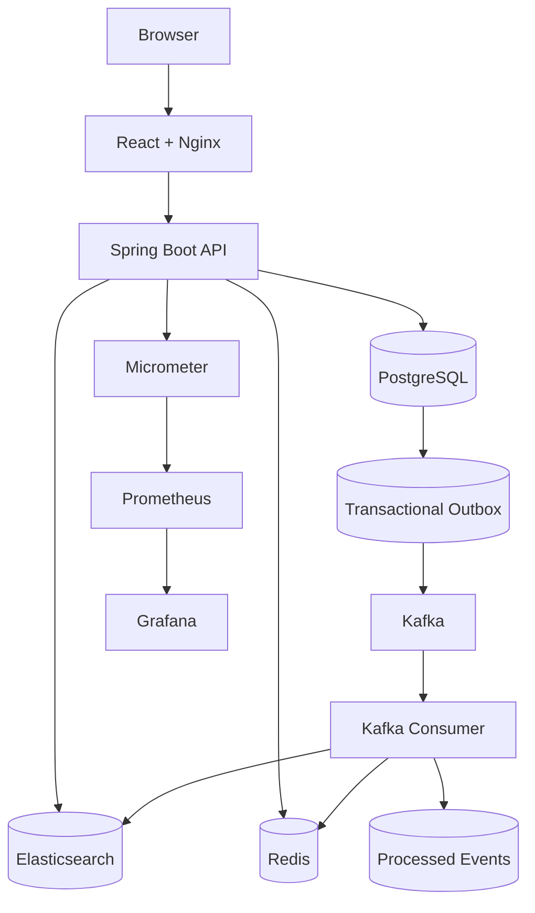

# ElasticShop Search Platform

A production-style e-commerce search platform demonstrating full-text search, transactional data, event-driven indexing, caching, observability, containerization, automated testing, CI, and reliability patterns.

## Architecture



## Technology

| Area | Technology |
|---|---|
| Frontend | React, Vite, Nginx |
| Backend | Java 21, Spring Boot |
| Source of truth | PostgreSQL |
| Search | Elasticsearch |
| Messaging | Apache Kafka |
| Cache | Redis |
| Metrics | Micrometer |
| Monitoring | Prometheus |
| Dashboard | Grafana |
| Containers | Docker Compose |
| Testing | JUnit, Maven |
| CI | GitHub Actions |

## Search features

- BM25 full-text search
- Field boosts and phrase boosts
- Exact-name boost
- Rating-assisted relevance
- Brand/category/price/rating/stock filters
- Sorting and pagination
- Highlighting
- Facets and aggregations
- Fuzzy typo tolerance
- `search_as_you_type` autocomplete
- Redis caching with Kafka-driven invalidation

## Data architecture

PostgreSQL is the authoritative product catalog. Elasticsearch is a derived search index.

The application uses the stable alias `products`. Phase 9 migrates the physical index from `products_v1` to `products_v2`, adding `search_as_you_type` while keeping application configuration unchanged.

## Transactional Outbox

Product changes no longer depend on a direct database-commit-then-Kafka-publish sequence.

1. Update the product row.
2. Insert `outbox_events`.
3. Commit both atomically.
4. A scheduled relay publishes pending rows to Kafka.
5. The consumer updates Elasticsearch.
6. Redis search cache is invalidated.
7. The event UUID is stored in `processed_events`.

This closes the application crash window between product persistence and creation of the integration event.

## Idempotency

New Kafka payload:

`eventId|UPSERT|productId`

If the same event is delivered again, `processed_events` prevents duplicate processing. Elasticsearch also uses the stable product ID as the document ID.

## Search relevance

Primary field weights:

- name: 4x
- brand: 2.5x
- category: 1.5x
- description: 1.5x

Exact-name and phrase matches receive additional boosts. Rating is only a small secondary `function_score` signal so an irrelevant highly-rated product does not overpower a strong textual match.

## Redis

- Advanced search TTL: 60 seconds
- Facet TTL: 300 seconds
- Kafka product events invalidate search cache

## Observability

Spring Boot Actuator + Micrometer expose health and application metrics. Prometheus scrapes the backend and Grafana displays search traffic, search duration, JVM heap, HTTP traffic, uptime, and availability.

## Local URLs

| Service | URL |
|---|---|
| Application | http://127.0.0.1:5173 |
| Backend | http://127.0.0.1:8080 |
| Elasticsearch | http://127.0.0.1:9200 |
| Prometheus | http://127.0.0.1:9090 |
| Grafana | http://127.0.0.1:3000 |

Local Grafana credentials: `admin / admin`.

## Run

```bash
docker compose up -d --build
```

## Stop without deleting data

```bash
docker compose down
```

Do not use `docker compose down -v` unless you intentionally want to remove persistent local data.

## Important APIs

- `GET /api/search/advanced`
- `GET /api/search/fuzzy?q=MackBook`
- `GET /api/search/autocomplete?q=Apple%20Mac`
- `GET /api/search/facets`
- `GET /api/cache/status`
- `GET /api/outbox/status`
- `GET /api/catalog/events/status`
- `GET /actuator/health`
- `GET /actuator/prometheus`

## Testing

Backend:

```bash
cd backend
./mvnw clean verify
```

Frontend:

```bash
cd frontend
npm ci
npm run build
```

## CI

GitHub Actions verifies the Java 21 backend, Maven/JUnit tests, React production build, backend Docker image, and frontend Docker image.

## Engineering patterns demonstrated

- PostgreSQL source of truth
- Elasticsearch derived index
- Kafka event-driven synchronization
- Transactional Outbox
- Idempotent consumer
- Redis cache invalidation
- Elasticsearch aliases and index versioning
- Search relevance tuning
- Health/readiness/liveness
- Structured API errors and validation
- Micrometer/Prometheus/Grafana
- Docker Compose
- GitHub Actions CI

## Interview discussion

**Why PostgreSQL + Elasticsearch?** PostgreSQL owns reliable transactional data; Elasticsearch handles analysis, relevance, fuzzy search, highlighting, facets, and autocomplete.

**Why Kafka?** It decouples product persistence from search indexing and allows independent future consumers.

**Why Redis?** Hot repeated searches and aggregations can avoid repeating the same Elasticsearch work.

**Why the Transactional Outbox?** A direct database-commit-then-publish flow can lose an event if the service crashes in between. The outbox stores the event in the same database transaction as the product update.

**Why idempotency?** At-least-once delivery can produce duplicates, so event UUIDs are tracked before accepting repeat processing.

**Why an Elasticsearch alias?** The application targets `products`, allowing physical index migrations such as `products_v1 -> products_v2` without changing application configuration.

**Why not rank by rating alone?** Query relevance should stay primary; rating is a controlled secondary quality signal.

## Future extensions

- Debezium CDC
- Testcontainers
- OpenTelemetry tracing
- Authentication/authorization
- Kubernetes
- Load testing
- MRR/NDCG relevance evaluation
- Semantic and hybrid search
